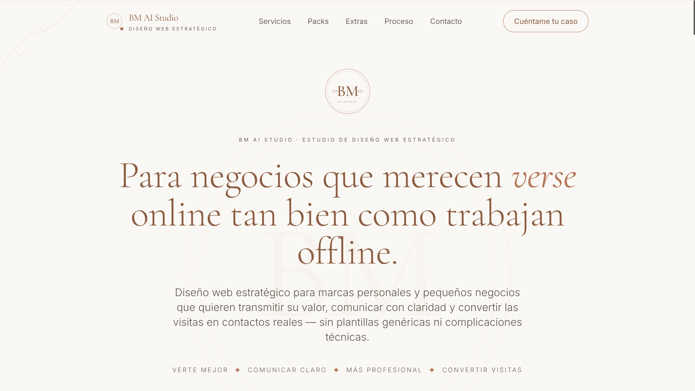
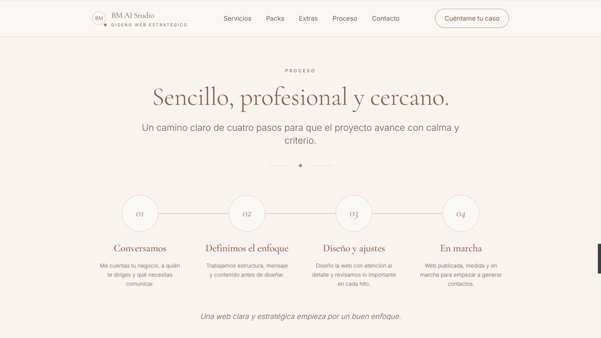
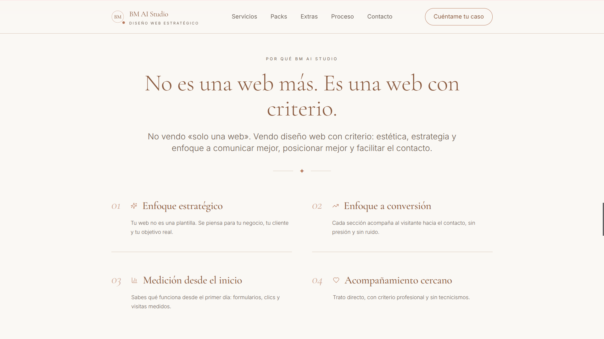

# BM AI Studio

Portfolio of practical AI projects, agile workflows, digital operations and strategic web solutions.

## About
BM AI Studio is focused on practical digital solutions that combine AI, content systems, lightweight automation and strategic web thinking.

## Main areas
- AI-assisted writing and structured content
- Prompt design and workflow logic
- Lightweight automation for digital operations
- Strategic landing pages and web presentation
- Practical support for lead capture and service-based businesses

## Tools
- ChatGPT
- Make
- Lovable
- Canva
- Google Workspace

## Current focus
This portfolio brings together practical examples of applied AI, prompt workflows, digital systems and strategic web projects.

## Links
- Website: https://bm-ai-studio.lovable.app
- LinkedIn: https://www.linkedin.com/in/beatrizmerinomunoz/
## Visual examples

### BM AI Studio website

